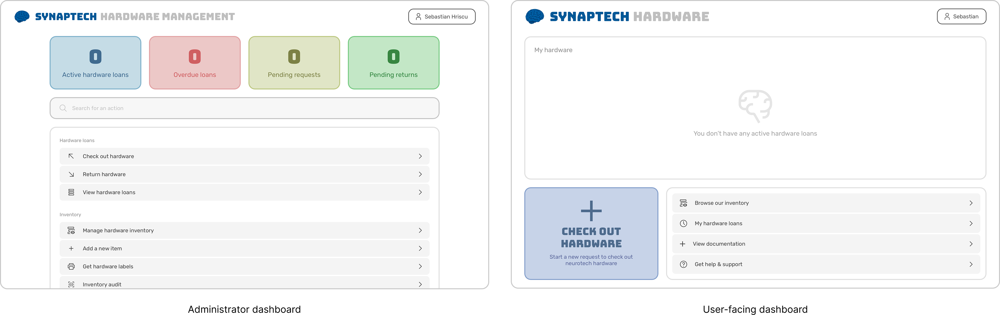

</img>

# Hardware Management System (HMS)
One of Synaptech's missions at UW is to increase access to neurotechnology education through workshops, labs, and hackathons, and by letting students borrow research-grade equipment for their own projects, from EEG and VR to microcontrollers and everything in between. Synaptech HMS is the system that manages that equipment. Members browse available hardware, request a loan, and sign a loan agreement; admins review and approve the request; and everything from pickup to return is tracked with barcode scanning, automated emails, and a full audit trail.

Live at https://hardware.synaptechuw.org

</img>

## Tools & Technologies

- **Frontend**: React, TypeScript, Vite, React Router
- **Backend**: Supabase (Postgres, Auth, Storage, Edge Functions), Resend (automated emails)
- **Barcode scanning**: zxing-wasm, barcode-detector
- **PDF & labels**: jsPDF, pdf-lib, html2canvas
- **Testing & linting**: Vitest, React Testing Library, Oxlint
- **Deployment & CI**: Cloudflare, GitHub Actions

## The hardware flow


## User documentation

### Member functionality
- **Authentication**
  - Login & create account
  - Complete profile setup
- **Inventory**
  - Browse hardware inventory
- **Hardware loans**
  - Check out hardware
  - Return hardware
  - Manage my hardware loans

### Administrator functionality
- **Administrative**
  - Manage user roles
  - Access app audit log
- **Hardware loans**
  - Check out hardware
  - Return hardware
  - Manage all hardware loans
- **Inventory**
  - Manage inventory (add / edit items)
  - Print labels
  - Get a replacement label
  - Run an inventory audit
- **Email**
  - Manage automated email content
  - View automated email log

## Developer environment setup

#### Prerequisites
- Node.js installed
- Access to the Synaptech HMS Supabase project
- Access to the Synaptech Resend account

#### 1. Install packages
```bash
npm install
```
#### 2. Add Supabase keys
Create an ```.env.local``` file and paste the corresponding API key and project URL:
```
VITE_SUPABASE_URL=
VITE_SUPABASE_ANON_KEY=
```
#### 3. Add Resend keys
Run the following commands with the corresponding API key value.
```
npx supabase secrets set RESEND_API_KEY=
npx supabase secrets set EMAIL_FROM_ADDRESS=hardware@mail.synaptechuw.org
```
#### 4. Build & run
```bash
npm run dev
```


## License

```
Copyright © 2026 Synaptech (University of Washington). All rights reserved.

This software and its source code are the property of Synaptech Registered Student Organization
(RSO) and are made available publicly for transparency and portfolio purposes. Current Synaptech 
RSO officers and members may use, modify, and deploy this project for club operations. Reproduction,
redistribution, or use of this software or its source code outside of Synaptech RSO, in whole or
in part, for any purpose, requires prior written permission from Synaptech RSO leadership.
```
