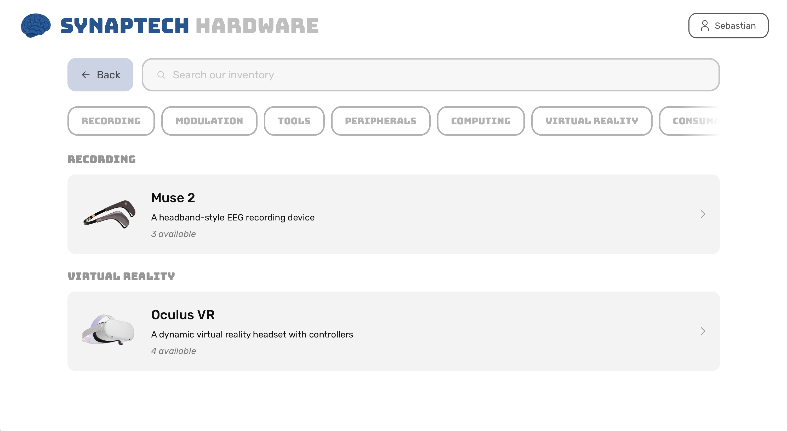
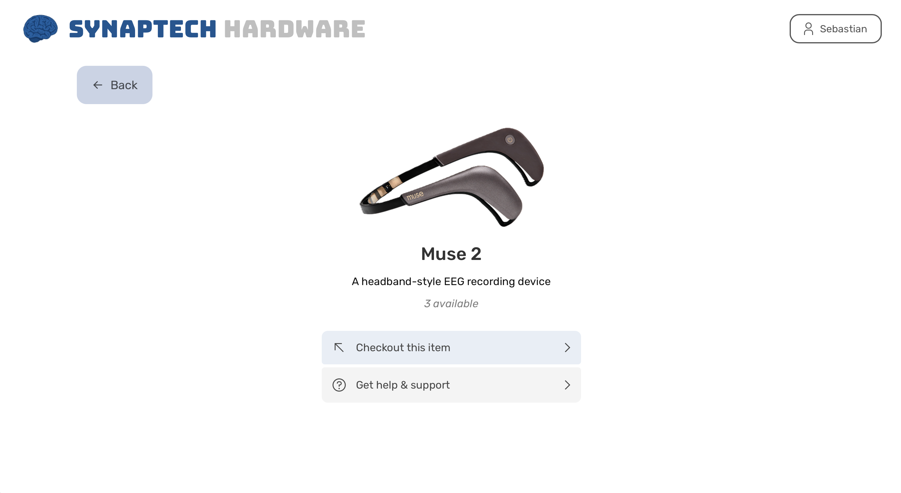

# Browse hardware inventory

This functionality is available to non-admin users

1. Go to the HMS home dashboard

</img>

2. Click on "browse our inventory"

</img>
   

4. You can now search & filter through all available items. For more info, click on an item

</img>

5. In the item detail page you'll be able to view documentation if available, and initiate a checkout.
6. The help & support links to our #hardware channel in the Discord if you need troubleshooting support
