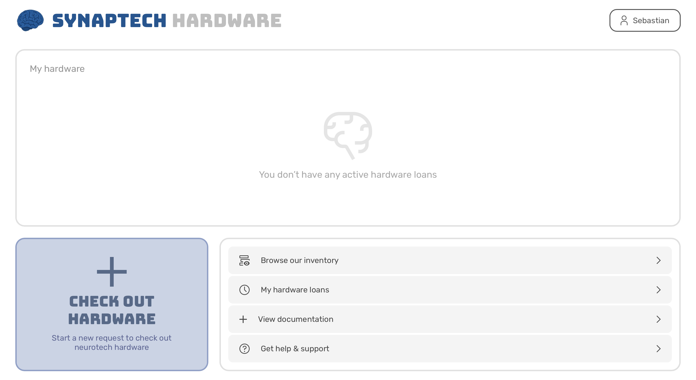
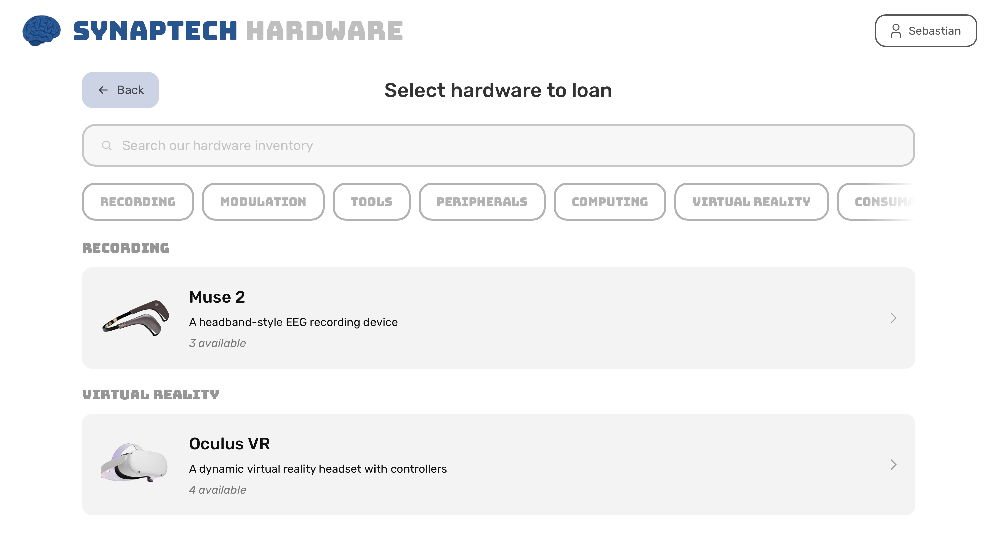
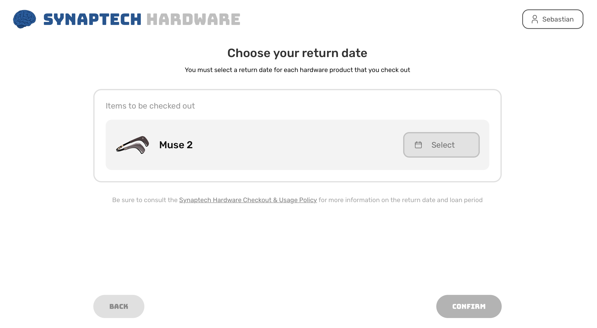
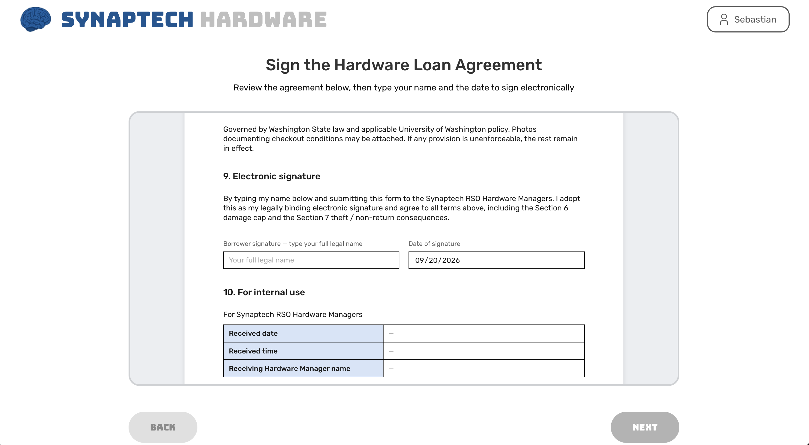
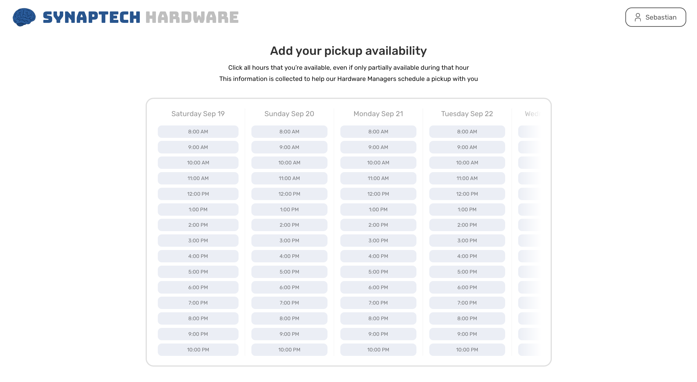

# Check out hardware

This guide outlines how to check out hardware as a non-admin user.

1. Go to the HMS home dashboard

</img>

2. Click on the big blue "check out hardware" button

</img>

3. Choose an item to loan by clicking on it

</img>

4. Select the date that you plan to return your hardware on. There is also a link to our Hardware Checkout & Usage Policy, which has the most up to date information on loan period restrictions

   
</img>

5. Read & sign the Hardware Loan Agreement by scrolling in the document and typing your name in the signature field. Be sure to verify that the information in the document about you and the hardware you're checking out is accurate. Then press next.

</img>

6. Now click or drag on the times that you would be available to pick up the hardware. This is optional, but it streamlines the process for our Hardware Managers.

7. Click Done
8. Now, you'll receive a confirmation email from HMS and soon, one of our Hardware Managers will reach out to you on Discord or by email to schedule a time to collect the requested item.

