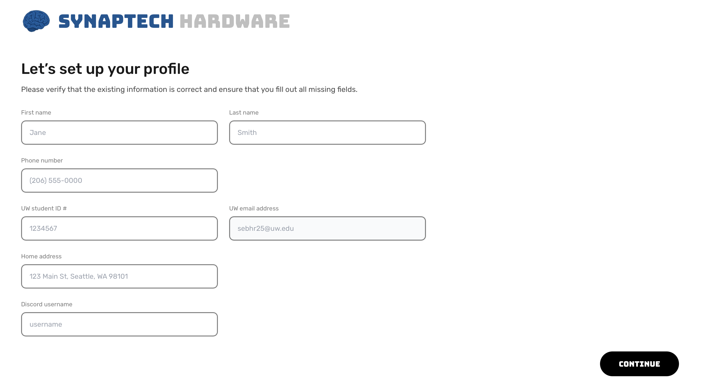

# Complete profile setup

After creating an account for the first time (as an admin or as a member) with Synaptech HMS, you are required to fill in the following information to complete your profile

</img>

Filling out these fields truthfully is required in order to use the app as these details (student ID, email, phone number, etc) are used to fill in the fields in the Hardware Loan Agreement. Failure to provide accurate information to complete your profile will result in all loan requests being denied until the information is corrected.

This information is stored but can be deleted at any time by sending a written request to synaptechuw@gmail.com. 

