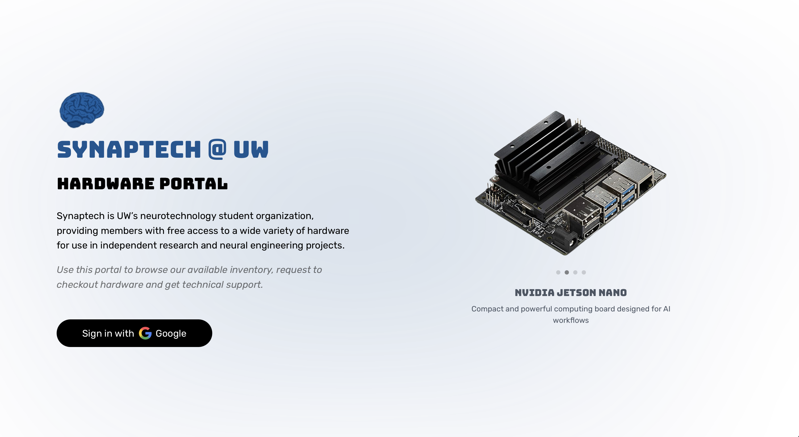

# Login

1. Navigate to https://hardware.synaptechuw.org

   
</img>

3. Click the Sign in with Google button

   
4. You will be prompted to select a Google account. You **must** use your UW google account.

   
6. Now, you'll be redirected to the user dashboard

   
</img>

# Create account

1. Follow the login procedure above

   
3. Go through the steps in [Complete profile setup](complete-profile-setup.md) to add your personal info
