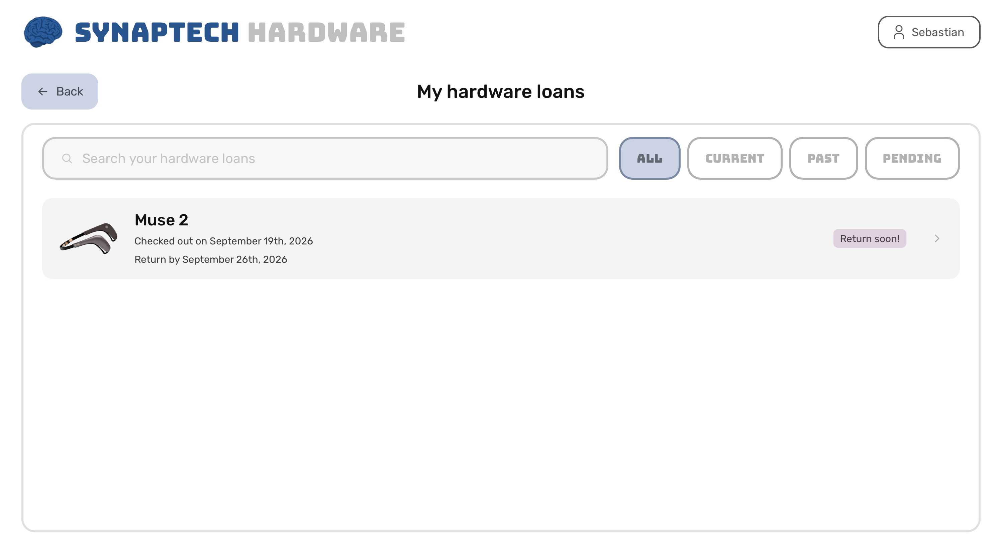
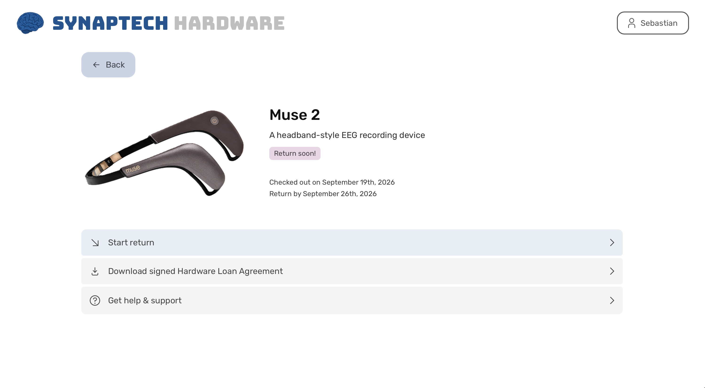
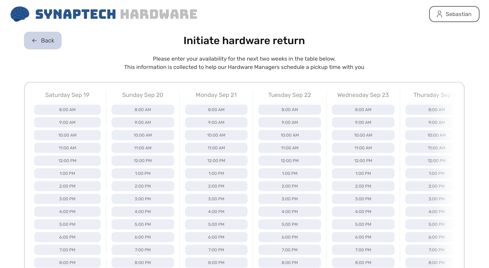

# Return hardware

This guide outlines how to return hardware as a non-admin user.

1. Go to the HMS home dashboard

</img>

2. Click on the loan of interest from your dashboard, or go to My hardware loans

</img>

3. View more details of the loan you want to return

</img>

4. Click on Start return

</img>

5. You'll be prompted to enter your availability (optional) which helps us coordinate a time to return the product.

6. Either click Skip or Done, and your return request will be submitted
7. A Hardware Manager will reach out to you soon to schedule a pickup. 
